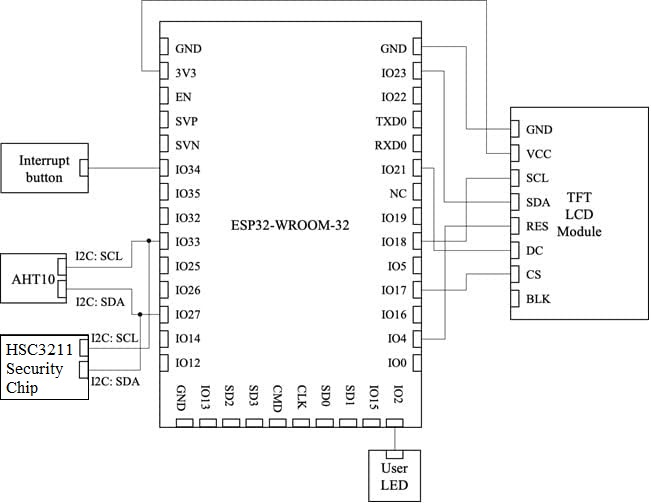
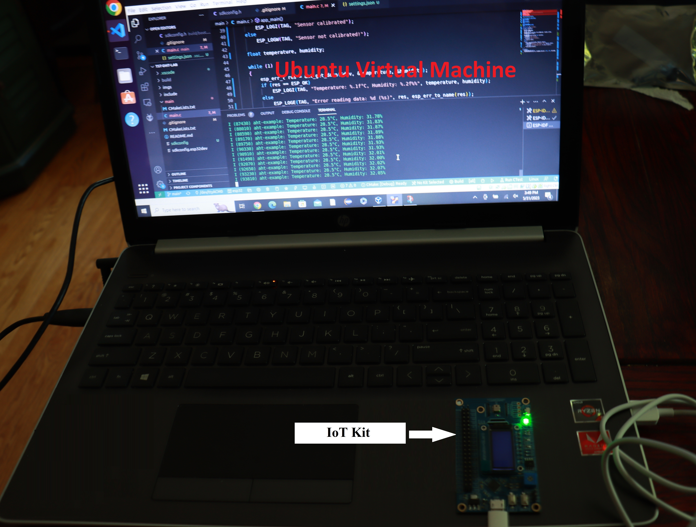
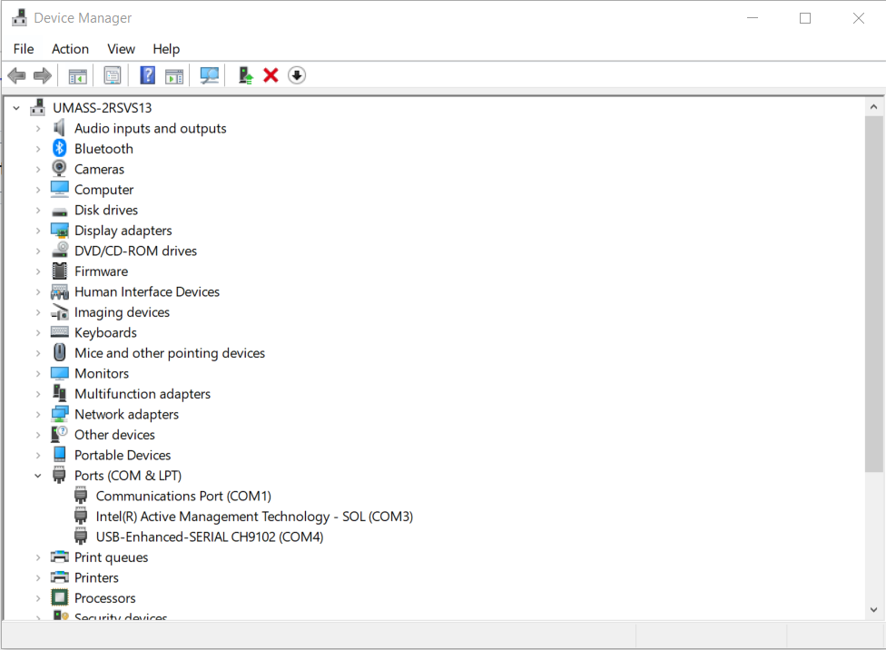
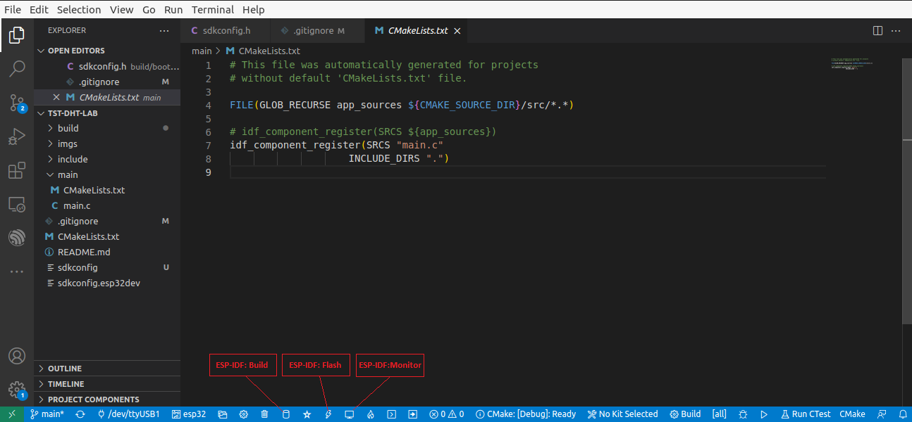
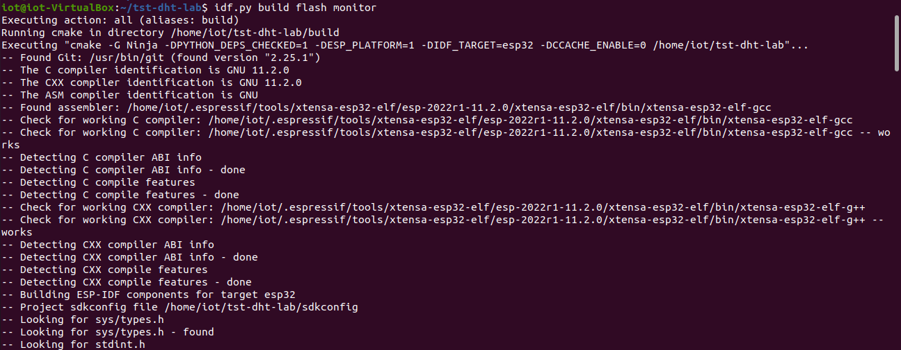

# Get started with ESP32 via VS Code and the ESP-IDF extension 

This project jumps start the use of the ESP32 and programming environment. An ESP32 microcontroller is used to read an AHT10 humidity and temperature sensor using a [third party sensor library---esp-idf-lib](https://github.com/UncleRus/esp-idf-lib), which has been installed at /home/iot/esp/esp-idf-lib in our Ubuntu VM.

The hardest part is to make USB to UART Bridge driver work.

## Install VirtualBox and Import Ubuntu VM Appliance (Optional)

- If not, install [VirtualBox](https://www.virtualbox.org/wiki/Downloads) and [VirtualBox Extension Pack](https://www.virtualbox.org/wiki/Downloads) as Administrator on [Windows 10](https://www.youtube.com/watch?v=8mns5yqMfZk) and [Mac OS X](https://www.youtube.com/watch?v=lEvM-No4eQo).
- Download the [UbuntuIoT-35GB.ova](https://www.cs.uml.edu/~xinwenfu/VMs/UbuntuIoT-35GB.ova) for the Ubuntu VM
- To import .ova file into VirtualBox, just click the downloaded .ova file and follow the on-screen instructions.
- After the import, you will see the Ubuntu IoT VM in the Oracle VM VirtualBox Manager.  
- *USB Device Filters* are already configured for the Ubuntu VM so that we can access the IoT kit via USB inside of Ubuntu VM.
- **Ubuntu VM credentials**
  - Username: IoT
  - Password: toi
  - sudo password: toi
- If a student feels the Ubuntu IoT VM is slow, please watch [How to improve Linux performance in a VirtualBox VM](https://www.youtube.com/watch?v=tbF8jNjD_IE).

## The IoT kit

The diagram below shows how the components of the ESP-32 SaTC-PCB module are connected to the ESP-32. **No actions are necessary**.   



You can see how the IoT kit is connected to a Laptop in the picture below. 

 

## Install the CP210x USB to UART Bridge VCP Driver

1. **Note**: Don’t start the Ubuntu VM yet.

2.	Connect the ESP32 board to your computer via a micro USB cable.

3.	Install the USB to UART bridge driver on the host computer, which will run the guest Ubuntu VM. 
    - **Windows host**: It appears Windows installs the appropriate driver once the IoT kit is plugged. Within Windows' *Device Manager*, a serial port shall show up under *Ports (COM & LPT)*. <br>   
    - **macOS host**: It appears macOS has the appropriate driver installed already. When the IoT kit is plugged in a USB port of a Mac computer, within Terminal, run ls /dev/*. /dev/cu.usbserial-0001 or similar shall be seen. When unplugged, the device disappears. 
      - If there is no /dev/cu.usbserial-0001, please download and install [CP210x USB to UART Bridge VCP Drivers](https://www.silabs.com/developers/usb-to-uart-bridge-vcp-drivers) (CP210x VCP Mac OSX Driver). 
      - Unzip the downloaded zip file. In the created macOS_VCP_Driver folder, run SiLabsUSBDriverDisk.dmg and then Install CP210x VCP Driver.app. After successful installation, within Terminal, run ls /dev/*. /dev/cu.SLAB_USBtoUART shall show up.
    - **Linux Host**: It appears Linux distributions like Ubuntu has the appropriate driver installed already. However, the following steps are needed for our Ubuntu VM to use the IoT kit:
      - Become a user with the sudo privileges. e.g., *su cyberadmin*.
      - *sudo adduser student1 vboxusers* # student1 is the user that runs our Ubuntu IoT VM.
      - Reboot the Linux host.

4. Log into the Ubuntu VM, within the *Terminal*, run /ls/dev to see ttyACM0 (Note it may appear as ttyUSB0).
  - When the mcro-usb cable of the IoT kit is unplugged from your host computer, ttyACM0 disappears. 

  
**Note**: It appears that the CP210x USB to UART Bridge VCP Driver has some issues. The following are some troubleshooting tips.
  - Make sure the correct micro usb cable is used. The micro usb is like the one used for phones for both data communication and power supply.
  - Try different USB ports on the computer and see which one works. 
  - Sometimes, unplugging the micro usb cable and plugging it back in will address the issue.

## Clone the project 

**Note**: By default, this project is already located in the ``` ~/esp/IoT-Examples/ ``` directory of the Ubuntu VM.

If you do not have the project, start the Ubuntu VM and clone this GitHub project within a folder. 
```
git clone https://github.com/xinwenfu/tst-dht-lab.git
```

## Build, Upload and Test

1. Start Visual Studio Code. Open the project by navigating to the tab *File* -> *Open Folder*. 
2. Click the *ESP-IDF: Build* icon on the status bar at the bottom of the VS Code interface to build the project. 
   - Refer to the picture below.
   - If the icon does not work, use the alternative approach provided at the end of this post.
4. Click the *ESP-IDF: Flash* to upload the firmware onto the ESP32 board. 
   - **Note**: During the uploading process, you may need to hold down the boot button until the uploading starts.
   - Refer to the picture below.
   - If the icon does not work, use the alternative approach provided at the end of this post.
5. Click the *ESP-IDF: Monitor* icon to open the Serial Monitor to see the output from the ESP32 board. 
   - Refer to the picture below.
   - If the icon does not work, use the alternative approach provided at the end of this post.



### Alternative Build, Upload and Monitor in a Console (Optional)
**Alternatively**, Build, Upload and Monitor can be done in a terminal sessions as shown below.
1. Open a *Terminal*.
2. Run the shell script **~/esp/esp-idf/export.sh**.
    - This script is run as a source, not directly executed.
```sh
# Take note of the period in front of the script, this means we are running it as a source.
$ . ~/esp/esp-idf/export.sh
```
1. Navigate to your project file.
2. Run the following commands.
   * Build.
    ```sh
    $ idf.py build
    ```
   * Flash
    ```sh
    $ idf.py flash
    ```
   * Monitor 
    ```sh
    $ idf.py monitor
    ```
> Note that the commands can be combined and run sequentially as shown in the provided image




