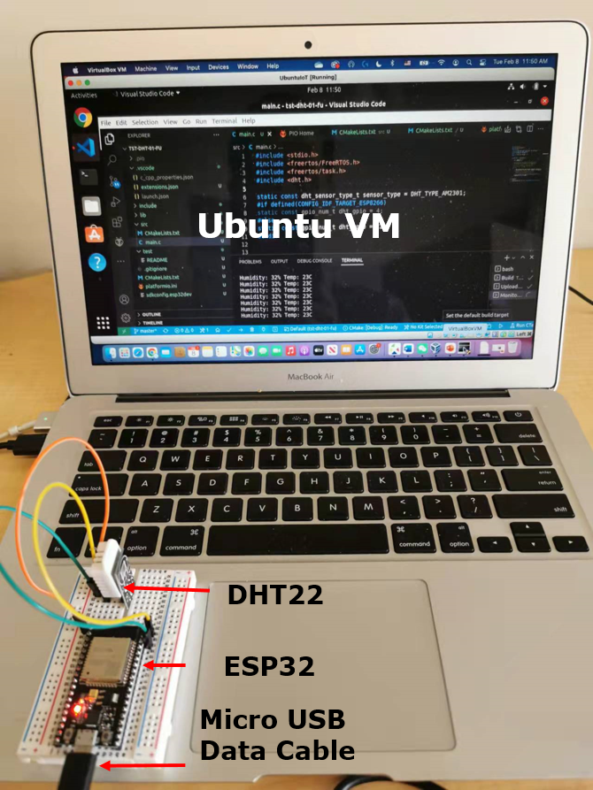
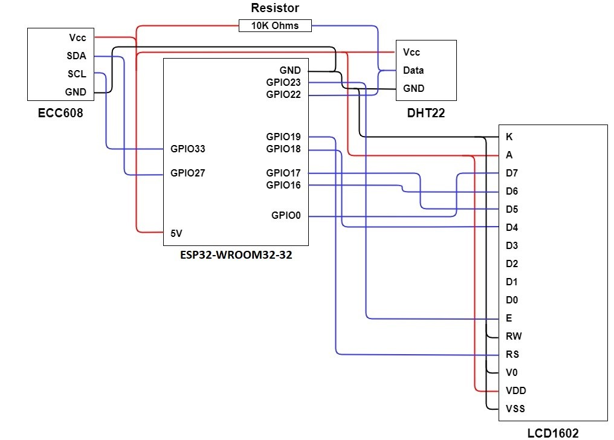

# DHT22 

This project jumps start the use of ESP32 and programming environment. The hard part is to install the CP210x USB to UART Bridge VCP Drivers and make it work.

# Install the CP210x USB to UART Bridge VCP Driver

1.	Connect the ESP32 board to your computer via a micro USB cable.
2.	Install the USB to UART bridge driver on the host computer, which will run the guest Ubuntu VM. Note: Don’t start VirtualBox yet if installed.
    - Windows host: Install [the CP210x USB to UART Bridge VCP Drivers](https://www.silabs.com/developers/usb-to-uart-bridge-vcp-drivers) (CP210x Universal Windows Driver) for Windows. After installation, under Ports within the Windows Device Manger, you shall see Silicon Labs CP210x USB to UART Bridge (COMx), where x may be different at different computers.
    - macOS host: It appears macOS has the appropriate driver installed already. When the IoT kit is plugged in a USB port of a Mac computer, within Terminal, run ls /dev/* and /dev/cu.usbserial-0001 or similar shall be seen. When unplugged, the device disappears. If there is no /dev/cu.usbserial-0001, please install [CP210x USB to UART Bridge VCP Drivers](https://www.silabs.com/developers/usb-to-uart-bridge-vcp-drivers) (CP210x VCP Mac OSX Driver). Unzip the downloaded zip file. In the created macOS_VCP_Driver folder, run SiLabsUSBDriverDisk.dmg and then Install CP210x VCP Driver.app. After successful installation, within Terminal, run ls /dev/* and dev/cu.SLAB_USBtoUART shall show up.
3.	Install VirtualBox and VirtualBox Extension Pack as Administrator on Windows 10 and Mac OS X.
4.	Import .ova file into VirtualBox. Just click the .ova file and follow the on-screen instructions. After the import, you shall see the Ubuntu IoT VM in the Oracle VM VirtualBox Manager. There is no need of configuring the USB of this VM, which has the following credentials. After login, within “Terminal”, run /ls/dev to see ttyUSB0. When the mcro-usb cable of the IoT kit is unplugged from your host computer, ttyUSB0 disappears. 
5.	If a student feels the Ubuntu IoT VM is slow, please watch [How to improve Linux performance in a VirtualBox VM](https://www.youtube.com/watch?v=tbF8jNjD_IE).

# Set up the IoT kit

 
