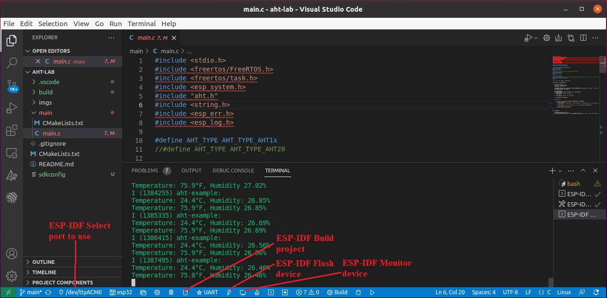

# Get started with ESP32 via VS Code and the ESP-IDF extension 

This project jumps start the use of the ESP32 and programming environment. An ESP32 microcontroller is used to read an AHT10 humidity and temperature sensor using an additional sensor library [esp-idf-lib](https://github.com/UncleRus/esp-idf-lib), which has been installed at /home/iot/esp/esp-idf-lib on our Ubuntu VM.

**Notes**: 
* The [esp-idf-lib](https://github.com/UncleRus/esp-idf-lib) components are included utilizing the *EXTRA_COMPONENT_DIRS* variable in the [CMakeLists.txt](./CMakeLists.txt) file. This occurs in multiple labs and more information can be found on ESP-IDF's [build system description](https://docs.espressif.com/projects/esp-idf/en/v5.1/esp32/api-guides/build-system.html).
* The hardest part is installing the <!-- CP210x USB -->  to UART Bridge VCP Drivers on the host machine and making it work.
* The (Optional) tag in the sections for *all* repositories specifies steps of that section are *already done* for the student if using the provided Virtual Machine.


## Install VirtualBox and Import Ubuntu VM Appliance (Optional)

- If not, install [VirtualBox](https://www.virtualbox.org/wiki/Downloads) and [VirtualBox Extension Pack](https://www.virtualbox.org/wiki/Downloads) as Administrator on [Windows 10](https://www.youtube.com/watch?v=8mns5yqMfZk) and [Mac OS X](https://www.youtube.com/watch?v=lEvM-No4eQo).
  - New Apple computers with M1 and M2 chips do not support VirtualBox yet.
- Download the [UbuntuIoT-50GB.ova](https://www.cs.uml.edu/~xinwenfu/VMs/UbuntuIoT-50GB.ova) for the Ubuntu VM
- To import .ova file into VirtualBox, just click the downloaded .ova file and follow the on-screen instructions.
- After the import, you will see the Ubuntu IoT VM in the Oracle VM VirtualBox Manager.  
- *USB Device Filters* are already configured for the Ubuntu VM so that we can access the IoT kit via USB inside of Ubuntu VM.
- **Ubuntu VM credentials**
  - Username: IoT
  - Password: toi
  - sudo password: toi
- If a student feels the Ubuntu IoT VM is slow, please watch [How to improve Linux performance in a VirtualBox VM](https://www.youtube.com/watch?v=tbF8jNjD_IE).

## The IoT kit

The diagram below shows how the components of the ESP-32 SaTC-PCB module are connected to the ESP-32. **No actions are necessary**.   


You can see how the IoT kit is connected to a Laptop in the picture below. 

 

## Install USB to UART Bridge Driver 
The hardest part is to make USB to UART Bridge driver of the IoT kit work so that we can communciate with the ESP32 chip on the IoT kit.

1. **Note**: Don’t start the Ubuntu VM yet.

2.	Connect the ESP32 board to your computer via a micro USB cable.

3.	Install the USB to UART bridge driver on the host computer, which will run the guest Ubuntu VM. 
    - **Windows host**: It appears Windows installs the appropriate driver once the IoT kit is plugged. Within Windows' *Device Manager*, a serial port shall show up under *Ports (COM & LPT)* while it is not necessarily COM4. <br>
      <br>
    - **macOS host**:
      - Within /dev, the device is listed as something like /dev/tty.usbserial-550D0193571
      - The Ubuntu VM has to be started as [root](https://forums.virtualbox.org/viewtopic.php?f=8&t=107333#p527198)!
        1. Start VirtualBox using `sudo virtualbox` within a terminal 
        2. Within VirtualBox, push the + button to add the Ubuntu VM, which is located within your home folder as a .vdi file
        3. Then just start your guest OS and USB devices should work
        4. Within Ubuntu VM, the usb device is called ttyACM0 within /dev
     
    - **Linux Host**: It appears Linux distributions like Ubuntu has the appropriate driver installed already. However, the following steps are needed for our Ubuntu VM to use the IoT kit:
      - Become a user with the sudo privileges. e.g., *su cyberadmin*.
      - *sudo adduser student1 vboxusers* # student is the user that runs our Ubuntu IoT VM.
      - Reboot the Linux host.

**Notes**: If black green shows up for the Ubuntu VM, try to increase Ubuntu VM -> Display -> Virtual Memory

5. Start and log into the Ubuntu VM, within the *Terminal*, run /ls/dev to see ttyACM0 (Note it may appear as ttyUSB0).
  - When the micro-usb cable of the IoT kit is unplugged from your host computer, ttyACM0 disappears. 

**Note**: The VM is already configured to use the IoT kit through its *USB Device Filters* (This VM -> Settings -> USB) as shown below. Once the VM starts, the COMX port on Windows disappears. When the VM is shut down, the COMX port on Windows shows up again.

 

  
**Note**: If there are issues, the following are some troubleshooting tips.
  - Make sure the correct micro usb cable is used. The micro usb is like the one used for phones for both data communication and power supply.
  - Try different USB ports on the computer and see which one works. 
  - Sometimes, unplugging the micro usb cable and plugging it back in will address the issue.

## Clone the project (Optional)

**Note**: By default, this project is already located in the ``` ~/esp/IoT-Examples/ ``` directory of the Ubuntu VM.

If you do not have the project, start the Ubuntu VM and clone this GitHub project within a folder. 
```
git clone https://github.com/xinwenfu/tst-dht-lab.git
```

## Build, Upload and Test

1. Start Visual Studio Code. Open the project by navigating to the tab *File* -> *Open Folder*. 
2. Click the *ESP-IDF: Build* icon on the status bar at the bottom of the VS Code interface to build the project. 
   - Refer to the picture below.
   - If the icon does not work, use the alternative approach provided at the end of this post.
4. Click the *ESP-IDF: Flash* to upload the firmware onto the ESP32 board. 
   - **Note**: During the uploading process, you may need to hold down the boot button until the uploading starts.
   - Refer to the picture below.
   - If the icon does not work, use the alternative approach provided at the end of this post.
5. Click the *ESP-IDF: Monitor* icon to open the Serial Monitor to see the output from the ESP32 board. 
   - Refer to the picture below.
   - If the icon does not work, use the alternative approach provided at the end of this post.



### Alternative Build, Upload and Monitor in a Terminal/Console (Optional)
**Alternatively**, Build, Upload and Monitor can be done in a terminal sessions as shown below.
1. Open a *Terminal*.
2. Run the shell script ```~/esp/esp-idf/export.sh```, or the provided *alias* in the ```~/.bashrc```
    - This script is run as a source, not directly executed.
```sh
# This is the manual method
# Take note of the period in front of the script, this means we are running it as a source.
$ . ~/esp/esp-idf/export.sh

# This is one of the aliases provided, it does the same as the command above.
$ set-esp
```
**Notice**: The *$* if included indicates the start of a line in a terminal/shell. The *#* Indicates a comment

1. Navigate to your project file.
2. Run the following commands.
   * Build.
    ```sh
    $ idf.py build
    ```
   * Flash
    ```sh
    $ idf.py flash
    ```
   * Monitor 
    ```sh
    $ idf.py monitor
    ```
> Note that the commands can be combined and run sequentially as shown in the provided image


